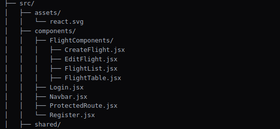

# Flight Booking Frontend

This is the frontend of the Flight Booking System, a React-based application built using Vite, 
Ant Design, and Tailwind CSS. The frontend communicates with the backend API to provide features like register, signin, flight, create,
update, delete flight management.

## Table of Contents

- [Features](#features)
- [Technologies Used](#technologies-used)
- [Installation](#installation)
- [Usage](#usage)
- [Folder Structure](#folder-structure)
- [Contributing](#contributing)
- [License](#license)

## Features

- User Authentication (Registration, Login, Logout)
- Flight Search Engine
- Responsive and User-Friendly Interface
- Admin Dashboard for Managing Flights

## Technologies Used

- **React**: A JavaScript library for building user interfaces.
- **Tailwind CSS**: A utility-first CSS framework for styling.
- **React Router DOM**: For handling routing in the application.
- **Ant Design (antd)**: A UI component library for React.
- **axios**: for handling API request.
- **jwt-decode**: for handling token and user data.

## Installation

To get a local copy up and running, follow these steps:

1. **Clone the Repository**

   ```bash
   git clone https://github.com/JithanRoy/flight-booking-frontend
   cd flight-booking-frontend

2. **Install Dependencies**
    bun install or any other package manager like npm or yarn

3. **Start the development Server**
    bun run dev


## Usage

- **Home Page**: 
  - Search for flights using the search bar.
  - add new flight details
  - update the flight details
  - delete the flight details

- **Search Results**: 
  - View available flights based on search criteria.

- **Flight Details**: 
  - Get detailed information about a selected flight.

- **Admin Dashboard**: 
  - Add, update, or delete flights.

##Folder Structure



## Contributing
Contributions are welcome! Please fork the repository and submit a pull request for any improvements or bug fixes.

## FAQ
Frequently asked questions about the project will be listed here.

## Contact
For any inquiries or support, please contact jithanroyjony@gmail.com.

